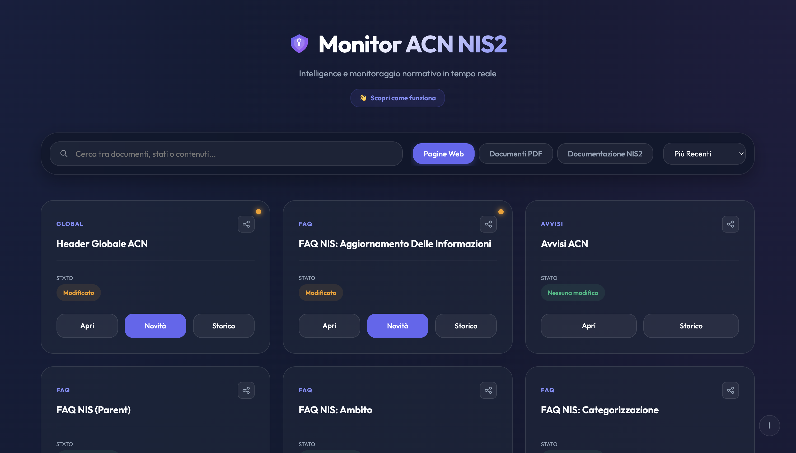

# 🛡️ Monitor ACN NIS2
### Intelligence e monitoraggio normativo in tempo reale per la Cybersicurezza Italiana

[](https://github.com/features/actions)
[](https://www.python.org/)
[](https://opensource.org/licenses/MIT)
[](https://deepmind.google/technologies/gemini/)

**Monitor ACN NIS2** è uno strumento avanzato di *Regulatory Intelligence* progettato per professionisti della cybersecurity, DPO e consulenti legali. Il sistema monitora h24 le sezioni critiche del sito dell'**Agenzia per la Cybersicurezza Nazionale (ACN)**, rilevando ogni variazione normativa, tecnica o procedurale relativa alla direttiva **NIS2**.

🔗 **[Visita la Dashboard Live](https://frascoh.github.io/monitor-acn-nis2/)**

---

## 🚀 Funzionalità Chiave

*   **🧠 Analisi Intelligente con AI**: Non solo notifiche. Ogni modifica rilevata viene analizzata da **Google Gemini 1.5 Flash** per produrre un riassunto esecutivo dell'impatto normativo e consigli azionati.
*   **📡 Monitoraggio Real-Time**: Scansione automatica ogni 5 minuti tramite GitHub Actions, garantendo una tempestività impossibile con controlli manuali.
*   **📄 Deep PDF Tracking**: Il sistema scarica e confronta il testo all'interno dei documenti PDF, scovando modifiche che spesso passano inosservate.
*   **🎨 Dashboard Premium**: Un'interfaccia web moderna in *Glassmorphism* (Dark Mode) che offre una visione d'insieme immediata dello stato di tutte le risorse monitorate.
*   **🔍 Ricerca Intelligente**: Motore di ricerca avanzato che scansiona non solo i titoli, ma anche il contenuto delle modifiche (additions/removals) e i riassunti AI.
*   **📂 Registro Atti Automatizzato**: Estrazione e classificazione automatica di decreti, determine e circolari con filtri per tipo, anno e mese.

---

## 🛠️ Architettura Tecnica

Il progetto è costruito su una filosofia **Serverless & GitOps**:

- **Core**: Python 3.10 per scraping (Requests), hashing e analisi differenziale.
- **Automation**: GitHub Actions gestisce l'orchestrazione e la persistenza dei dati direttamente nel repository.
- **Intelligence**: Integrazione con le API di Google Generative AI per l'interpretazione dei cambiamenti.
- **Frontend**: Single Page Application in Vanilla JS/CSS ospitata su GitHub Pages per la massima velocità e affidabilità.

---

## 🐋 Docker Usage

Per chi preferisce eseguire il monitor in un ambiente isolato o su un server proprio:

```bash
docker pull ghcr.io/frascoh/cyber-monitor-main:latest
docker run -e GEMINI_API_KEY="tua_chiave" -e EMAIL_SENDER="..." -v $(pwd)/archive:/app/archive ghcr.io/frascoh/cyber-monitor-main:latest
```

---

## ⚙️ Installazione e Setup Rapido

Vuoi creare la tua istanza personalizzata? Segui questi passi:

1.  **Fork del repository**: Crea una copia sul tuo account GitHub.
2.  **Configura i Secret**: Vai su `Settings > Secrets and variables > Actions` e aggiungi:
    *   `GEMINI_API_KEY`: La tua chiave API di Google AI Studio.
    *   `EMAIL_SENDER` / `EMAIL_PASSWORD`: Credenziali SMTP per l'invio delle notifiche.
    *   `EMAIL_RECEIVER`: Indirizzo email destinatario dei report.
3.  **Permessi**: Assicurati che il workflow abbia i permessi di scrittura (`Settings > Actions > General > Workflow permissions > Read and write permissions`).
4.  **GitHub Pages**: Abilita GitHub Pages sulla cartella root per visualizzare la dashboard.

---

## 📊 Dashboard in Anteprima

La dashboard utilizza un design futuristico per rendere la consultazione dei dati un'esperienza piacevole ed efficiente. 



*   🟢 **Verde**: Risorsa aggiornata.
*   🟡 **Arancione**: Modifica rilevata negli ultimi 15 giorni.
*   🔵 **Azzurro**: Nuova risorsa identificata dal sistema.

---

## 📝 Disclaimer

*Questo progetto è uno strumento informativo **non ufficiale** sviluppato a scopo di supporto alla conformità. Non garantisce l'accuratezza totale delle informazioni e non sostituisce in alcun modo i canali ufficiali dell'Agenzia per la Cybersicurezza Nazionale.*

---

## 👨‍💻 Autore

**Lorenzo Frasconi**
*Esperto di Cybersecurity, AI e automazione.*

[](https://www.linkedin.com/in/lorenzo-frasconi/)
[](https://github.com/FRASCOH)

---

## 📄 Licenza

Distribuito sotto Licenza MIT. Vedi `LICENSE` per maggiori informazioni.

---
*Developed with ❤️ for the Italian Cybersecurity Community.*

